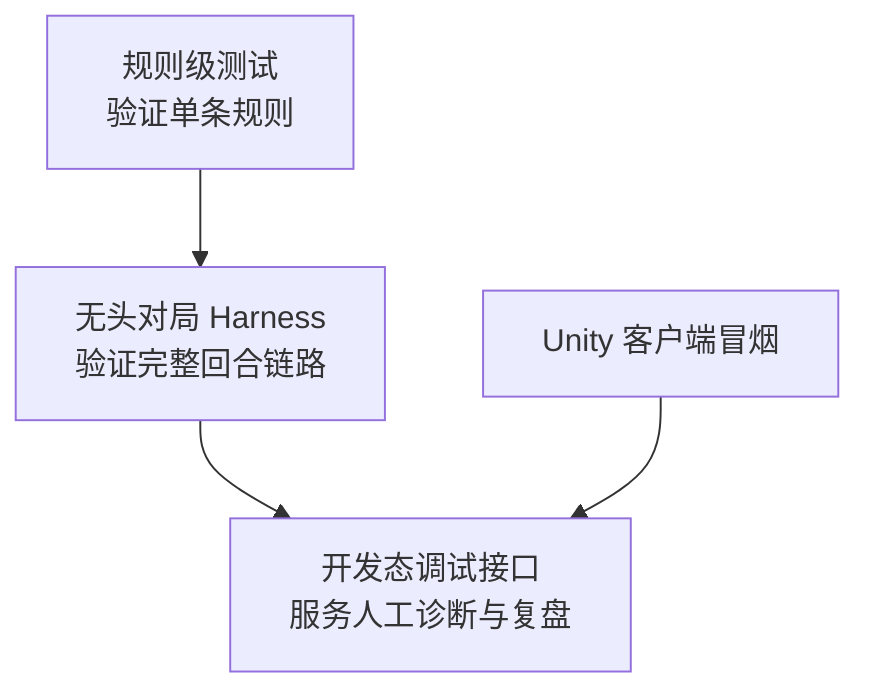

# Panoptes 无客户端调试与规则验证方案

> 状态：设计说明  
> 日期：2026-04-15  
> 适用范围：服务端规则开发、无头对局验证、开发态调试支持  
> 关联文档：  
> - [GDD 结构版](./gdd/2026-04-15-panoptes-gdd-v1-structured.md)  
> - [GDD 实现规划](./2026-04-15-panoptes-gdd-v1-implementation-plan.md)  
> - [回合重构计划](./TURN_V2_REFACTOR_PLAN.md)

## 1. 本文档解决什么

随着 Panoptes 的规则逐渐从“战斗演示”扩展为“城市、建筑、科技、政策、配方与战争共享统一回合语言”的国家系统，仅依赖 Unity 客户端进行规则验证会迅速暴露出三个问题。

第一，验证成本过高。很多规则错误并不是表现层问题，而是服务端裁决错误；若每次都要经过进房、开局、点击、提交回合和观察表现，调试周期会非常慢。第二，定位能力不足。客户端可以告诉开发者“结果不对”，却难以直接回答“是哪一条规则、哪一步事件、哪一次状态写入出了问题”。第三，回归覆盖薄弱。若缺乏无客户端验证层，就很难稳定验证“服务器是否能独立跑完一局”，也很难把规则正确性纳入 CI。

因此，Panoptes 必须建立一套不依赖客户端也能调试和验证规则的基础设施。这个基础设施的目标不是替代客户端，而是把规则正确性、完整回合链路和人工诊断拆成不同层级，各自使用最适合的工具。

## 2. 设计原则

无客户端调试与规则验证方案遵循以下原则。

第一，服务端规则正确性必须由服务端自己证明。科技推进、建城合法性、建筑接管、配方阻塞、主城判负等裁决，不应依赖客户端表现去“猜测是否正确”，而应通过服务端测试和服务端级回放直接验证。

第二，验证层要与玩法复杂度共同成长，而不是在后期才临时补。Panoptes 的长期目标包含大臣代理、信息失真和物流网络；如果没有无头验证层，后期每一条规则都会被 UI 交互和多层中间状态掩盖，调试成本会指数增长。

第三，调试工具要服务于三类不同问题：单条规则是否正确、一局游戏能否在服务端独立跑通、以及开发者如何快速观察状态和注入动作。这三类问题不应由同一个工具勉强承担。

第四，客户端只承担展示链路冒烟，不承担服务端规则基线。客户端联调当然仍然重要，但它验证的是“服务端输出能否被正确展示与驱动交互”，而不是“规则本身是否成立”。

## 3. 三层验证结构

Panoptes 的无客户端验证结构采用三层模型：规则级测试、无头对局 harness、开发态调试接口。

这三层并不是递进替代关系，而是职责分工关系。规则级测试回答“某条规则是否正确”，无头对局 harness 回答“服务器能否独立跑完一局”，开发态调试接口回答“开发者如何最快发现问题原因”，客户端冒烟则回答“已有规则能否被正确表现”。

## 4. 第一层：规则级测试

规则级测试直接针对 `domain / engine / event` 层展开，不经过网络，也不经过 Unity。它的职责是验证单条玩法裁决是否正确，以及相邻规则在有限上下文中的交互是否正确。

这一层适合覆盖的内容包括：

- 科技目标切换、进度累积与次回合生效
- 科技显式效果与修正效果的分层应用
- 建筑放置合法性与辖区约束
- 城外设施的延时接管规则
- 城市陷落时的部分接管、部分废墟逻辑
- 配方工作量推进、输入不足、延迟惩罚与产出边界
- 主城核心摧毁判负
- 国策修正的生效时机

这类测试必须尽量短、小、确定，不依赖全局房间流程。规则级测试的价值在于能快速定位“错的是哪一条规则”，并为之后的无头对局测试提供稳定基石。现有仓库中的 [research_system_test.go](/Users/hhm/code/panoptes/.worktrees/economy-runtime-unification/server/internal/engine/economy/research_system_test.go) 和多处 combat tests 已经证明这种路径可行，但覆盖范围仍主要集中在局部生产与战斗逻辑，尚未扩展到城市、建筑状态、政策和完整科技推进模型。

## 5. 第二层：无头对局 Harness

无头对局 harness 是本文最核心的一层。它的职责是：在完全不启动 Unity 客户端的情况下，创建对局、加载地图与静态数据、注入玩家命令、推进回合、捕获服务端输出，并验证一局游戏是否能在服务端独立走完。

现有 [integration_test.go](/mnt/c/Users/hhmcn/code/panoptes/server/internal/debug/integration_test.go) 已经展示了这一方向的最小雏形：通过 `captureTransport` 捕获消息、直接创建 `GameRoom`、提交回合并等待 `MsgPlanningStart` 和 `MsgTurnSettlement`。这个思路应当被正式化，而不是继续停留在手工联调测试的层面。

正式的 harness 应具备以下能力：

| 能力 | 作用 |
|---|---|
| 场景装配 | 加载静态目录、地图、玩家阵营、初始资源与规则参数 |
| 命令注入 | 直接向 `planning` 层注入研究、建造、配方、建城与单位命令 |
| 回合推进 | 自动等待 `planning`、自动 submit、推进到 `settlement` |
| 消息捕获 | 捕获并归档 `GameInit / PlanningStart / PlanningSnapshot / TurnSettlement / GameOver` |
| 状态快照 | 在每回合前后导出摘要或完整状态，用于断言与复盘 |
| 断言工具 | 直接断言“科技是否完成”“建筑是否接管”“主城是否被摧毁”等结果 |

这层的输出不应只是“测试通过/失败”，还应包括足以复盘问题的结构化产物，例如每回合结算 sections、玩家状态摘要、地图关键节点变化和单位去向。

无头对局 harness 最适合验证以下类型的问题：

- 从房间创建到若干回合结束，服务端是否能稳定推进
- 研究、建造、建城、战斗、判负等是否能在统一回合里共同成立
- 协议输出是否完整、顺序是否稳定、字段是否可供客户端消费
- 一次改动是否破坏了“服务器独立跑完一局”的能力

## 6. 第三层：开发态调试接口

无头对局 harness 解决的是“自动验证”，开发态调试接口解决的是“人工诊断”。开发者在排查问题时，经常需要快速查看当前状态、注入指令、强制推进回合、导出最近一次结算结果，而不是每次都重跑整个测试或打开客户端。

仓库里已经有两类可复用基础：

- [state_dumper.go](/mnt/c/Users/hhmcn/code/panoptes/server/internal/debug/state_dumper.go)：能输出简要状态摘要
- [middleware.go](/mnt/c/Users/hhmcn/code/panoptes/server/internal/debug/middleware.go)：能在 `DEV_MODE` 下记录入站与出站消息

这些能力应进一步演进成正式的开发态调试接口，建议包括：

| 接口 | 作用 |
|---|---|
| `dump state` | 输出当前回合、玩家、城市、建筑、单位和资源摘要 |
| `dump settlement` | 输出最近一次 `MsgTurnSettlement` 的结构化内容 |
| `inject command` | 在开发态向指定玩家注入 planning 命令 |
| `submit turn` | 强制提交某玩家或所有玩家本回合命令 |
| `step turn` | 快进一个完整回合并输出前后差异 |
| `load scenario` | 用预设场景初始化一局调试对局 |

这组接口可以通过多种形式暴露，例如开发态 HTTP、调试 RPC、命令行工具或仅测试环境可用的内部 helper。关键不是暴露方式，而是职责边界：它们服务于人工观察、手工复现和快速诊断，不直接承担回归正确性的主责任。

## 7. 场景化验证而不是纯随机验证

Panoptes 的规则验证不应主要依赖随机对局。随机对局当然有助于发现一些崩溃类问题，但它很难稳定覆盖关键裁决时序，也难以在失败时快速定位原因。对于当前基线，更有效的做法是建立若干场景化验证用例。

推荐优先建立以下场景：

1. `research_unlock_build`：验证研究目标推进、科技完成、建筑解锁与次回合生效。
2. `settler_found_city`：验证开拓者建城、城市核心建立、辖区成立与新城次回合产出。
3. `recipe_blocked_by_input`：验证配方在缺料时的低效推进、停滞或延迟惩罚。
4. `outer_facility_capture`：验证城外设施的“先失效、后接管”与参数 `N`。
5. `capital_destroy_gameover`：验证主城核心受损、摧毁和游戏结束。

每个场景都应尽量做到初始态可读、命令明确、断言集中。这样一来，harness 不再只是“把随机房间跑起来”，而是形成一套能与 GDD 条目逐一对账的规则样本。

## 8. 推荐实施顺序

无客户端调试与规则验证基础设施应按以下顺序落地。

第一步，扩充规则级测试，把 GDD 当前基线里的关键裁决都放进 `engine` 与 `event` 测试中。第二步，把现有 `captureTransport + GameRoom` 思路沉淀成可复用的无头对局 harness，而不是继续写临时 integration test。第三步，在 `DEV_MODE` 下把状态 dump、命令注入和 step-turn 工具正规化。第四步，再让客户端联调只承担展示链路冒烟。

这样的顺序可以保证服务端规则闭环先稳定成立，而不是让 UI 交互成为规则开发的前置条件。

## 9. 与主实现计划的关系

这份方案不是独立于主实施计划之外的附录，而应被视为主实施计划中的基础设施块。它至少应承担以下职责：

- 为 `M2 服务端规则闭环` 提供完成标准
- 为科技、城市、建筑、配方和战争系统提供无客户端回归手段
- 为后续接入双层迷雾、大臣接管和物流系统提供可持续验证底座

若没有这一层，Panoptes 的后续复杂系统会越来越依赖“点开客户端看看对不对”的人工试错，这会直接削弱规则开发速度和可信度。

## 10. 最终裁决

Panoptes 在新版 GDD 规则下的“服务器能独立跑完一局”，不应被理解为“服务器启动后随机跑几回合不崩”，而应被理解为一套完整能力：

- 规则可由服务端测试精确验证
- 一整局对局可在无客户端条件下被装配、推进、断言和复盘
- 开发者可在 `DEV_MODE` 下快速观察状态并手工复现问题

这三层共同成立，Panoptes 才真正拥有不依赖客户端的规则开发能力。客户端仍然重要，但它应当回到自己最合适的位置：验证展示、交互和体验，而不是承担服务端规则正确性的主裁判。
