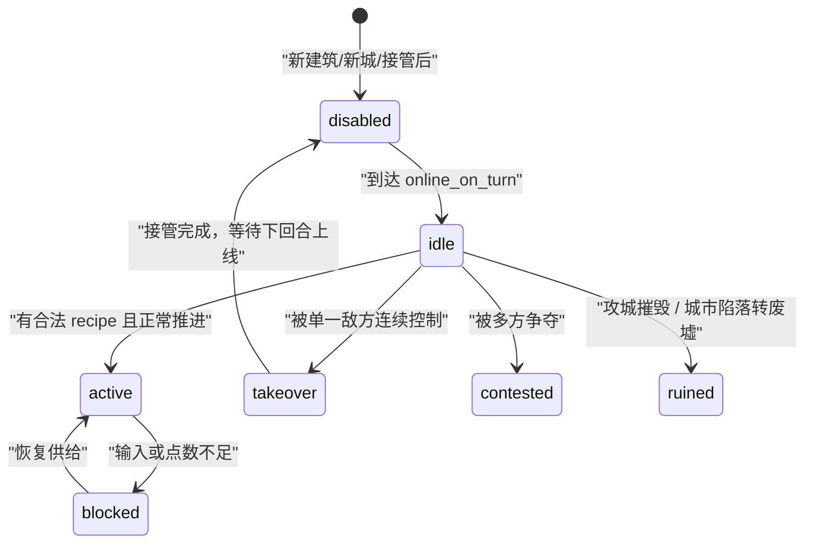

# Panoptes 服务端运行时与规则现状说明

> 更新时间：2026-04-16  
> 适用范围：当前仓库服务端真实实现  
> 本文描述“代码现在是如何工作的”，不是目标设计稿，也不是历史方案。若本文与 `server/internal/*` 当前实现不一致，应以代码为准，并尽快回写本文。
>
> 目标设计与本轮架构裁决见：`docs/2026-04-16-server-runtime-unification-plan.md`。经济与 progression 的归正结果见：`docs/2026-04-16-economy-and-progression-architecture.md`。本文只记录“现状”，不替代那两份文档。

## 1. 文档定位

Panoptes 当前服务端已经切到统一的 `planning / resolving` 回合模型，但很多文档仍混有旧架构、目标设计和历史方案。为了让后续开发、调试、补测试和排查规则问题时有一份能直接对照代码的说明，本文只回答三类问题：

- 当前运行时是怎样组织的。
- 每个游戏子系统由哪些 `domain / ecs / event / engine / game` 模块实现。
- 每条关键规则在当前代码里的实际生效时机是什么。

本文不承担以下职责：

- 不替代 GDD；GDD 负责目标设计。
- 不替代实现计划；计划文档负责里程碑与任务拆解。
- 不承诺“未来应该怎么做”；这里只记录“现在已经怎么做了”。

## 2. 总体架构

当前服务端主循环可以概括为：

1. 进入 `planning`。
2. 向玩家发送 `MsgPlanningStart` 与当前 planning snapshot。
3. 在 planning 阶段收集草案输入。
4. 所有玩家提交或超时后进入 `resolving`。
5. 先执行 `PlanningStartRunner`，再在 resolving 中按 `TurnResolutionRunner` 的 stage 顺序执行锁定、单位结算、地图动作、建筑生命周期、经济结算。
6. 生成 `MsgTurnSettlement`，并把新的权威状态投影为 `PlayerView / NodeView / UnitView`。
7. 若未终局，则推进到下一回合的 planning。

### 2.1 分层关系

当前真实依赖关系仍然符合项目总规则：

`transport -> game -> engine -> domain`

同时：

- `ecs` 提供实体装配与查询。
- `event` 提供统一状态写入口。
- `game/query` 与 `game/projection` 负责把权威状态投影成客户端消息。

### 2.2 当前“唯一写入口”的准确说法

需要特别说明一个实际情况：

- **Engine 子系统内部**遵循“只读状态、产出事件、由 `Event.Apply()` 写回”的规则。
- **Planning 草案写入**不是 engine system，它会直接写 `TurnRuntime.Planning`。
- **PlanningStartRunner** 也不是 engine system，但它现在不再静默改状态；它会返回 `PlanningStartResult.Events`，并把激活结果投影进 `MsgPlanningStart.planning_start_events`。

所以更准确的描述是：

- “结算阶段的正式裁决写回，主要通过 `event.Apply()` 完成。”
- “planning 草案与 planning-start promotion 属于运行时编排层的直接状态写入例外。”

## 3. 权威状态模型

核心状态根是 `server/internal/domain/state.go` 中的 `GameState`。

### 3.1 `GameState`

`GameState` 当前至少承载以下权威信息：

- 对局级状态：`GameID`、`Turn`、`Phase`、`IsOver`、`WinnerID`、`OverReason`、`Narrative`
- ECS 世界：`World`
- 地图索引：`Map`、`NodeIndex`
- 玩家状态：`Players`
- 回合临时态：`TurnRuntime`

其中 `TurnRuntime` 又分为两层：

- `PlanningInputs`
  - `BuildOrders`
  - `RecipeSelections`
  - `MinisterBuilds`
  - `MinisterMoves`
  - `MinisterDirectives`
  - `PendingPolicies`
  - `PendingResearch`
  - `PendingInstitutions`
  - `WarDirectives`
  - `UnitOrders`
- `ResolvingState`
  - `UnitOrders`
  - `ActiveMarches`
  - `PointBudgets`

### 3.2 ECS 组件

当前运行时的核心 ECS 组件定义在 `server/internal/domain/components.go`，`server/internal/ecs/components.go` 只是别名转发。

最关键的组件有：

- 地图节点
  - `PositionComp`
  - `NodeComp`
- 建筑
  - `BuildingComp`
  - `BuildingBindingComp`
  - `BuildingOperationComp`
  - `BuildingStateComp`
  - `FacilityTakeoverComp`
- 单位
  - `UnitStatsComp`
  - `UnitCategoryComp`
  - `UnitCapabilitiesComp`
  - `SiegeAbilityComp`
  - `DestroyAbilityComp`
  - `RangedAbilityComp`
  - `ChargeAbilityComp`
  - `StarvingComp`

### 3.3 建筑作用域与绑定关系

建筑创建时由 `ecs.CreateBuilding()` 按静态数据写入统一 binding：

- `BuildingBindingComp.Scope`
  - `city_core`
  - `in_city`
  - `out_of_city`
- `BuildingBindingComp.CityID`
- `BuildingBindingComp.ServiceCityID`
- takeover mode 不是 `disabled` 的建筑会挂 `FacilityTakeoverComp`

查询时统一走 binding 读取辅助：

- `ecs.ResolveCityID()`
- `ecs.ResolveServiceCityID()`

## 4. 回合编排子系统

### 4.1 入口与主循环

回合主循环入口在 `server/internal/game/turn/coordinator.go` 的 `Coordinator.Start()`。

当前行为：

1. 读取 `staticdata.Rules().TurnTimeLimitPlanning`
2. 进入 planning
3. `planning.Service.Enter()` 初始化草案 map
4. 通过 `runtime.PreparePlanningStartStateIfNeeded()` 触发 `PlanningStartRunner`
5. `host.NotifyTurn("planning")` 推送 planning start
6. 等待所有玩家提交或超时
7. 切到 resolving
8. `host.RunTurnResolution()`
9. 若未结束则 `state.Turn++`

### 4.2 PlanningStart 的延迟激活

`session.PreparePlanningStartState()` 现在只是 `PlanningStartRunner` 的兼容包装。真正的回合开始时机整理已经收敛到 `PlanningStartRunner` 的 3 个 stage：

- `TechnologyActivationStage`
- `InstitutionPromotionStage`
- `PlanningRefreshStage`

当前分别负责：

- `activatePendingTechnologies()`
  - 把上回合已完成但尚未正式生效的科技标成 active
  - 解析科技的显式效果
  - 正式解锁 building / recipe / policy candidate
  - 增加 institution slot
  - 处理科技 grant 的资源和单位
- `promoteInstitutionLoadouts()`
  - 把 `PendingPolicyIDs` 提升到 `ActivePolicyIDs`
  - 只在 `PendingActivationTurn <= state.Turn` 时生效
- `PlanningRefreshStage`
  - 承接“开回合刷新”规则的统一入口
  - 当前 MVP 明确保持 token 不在 planning start 自动恢复

这就是当前“科技完成本回合显示、下回合正式生效”和“institution 下回合生效”的真实实现落点。

此外，`Runtime` 现在有一个按回合号工作的 guard：

- `PreparePlanningStartStateIfNeeded()`

它保证：

- bootstrap / reconnect 期间若处于 planning，可以先准备一次再发 `MsgPlanningStart`
- 正常回合主循环进入同一 planning turn 时不会重复准备第二次

### 4.3 Resolving 总入口

统一结算入口在 `server/internal/game/settlement.go` 的 `RunTurnResolution()`，其内部已经改为调用 `TurnResolutionRunner`。

当前固定顺序是：

1. `PlanningCommitStage`
2. `OrderFreezeStage`
3. `UnitResolutionStage`
4. `MapActionStage`
5. `BuildingStage`
6. `EconomyStage`
7. `broadcastTurnSettlement()`
8. `checkGameOver()`
9. 清理本回合 planning / resolving 临时数据

需要注意两点：

- fatal turn 会在 combat 后直接终止后续 map/economy 链。
- planning lock-in 事件不再散落在 `RunTurnResolution()` 顶层手写 apply，而是统一由 `PlanningCommitStage + ResolutionCollector.ApplyNow()` 完成。

## 5. Planning 子系统

Planning 命令处理入口是 `server/internal/game/planning/service.go`。

### 5.1 Planning 的本质

planning 阶段当前不是直接改世界，而是写入两类“待结算输入”：

- 玩家国策/科研/机构装填等草案
- 本回合将要执行的建造、配方切换、单位指令

这些草案会被 `game/query/planning.go` 投影为 `MsgPlanningSnapshot` 回给客户端。  
需要注意：war zone 相关 proto 字段虽然仍存在，但当前服务端已将其视为非 MVP 输入并显式拒绝，不再写入 snapshot。

### 5.2 当前已接入的 planning 命令

- `set_policy`
- `set_institution_loadout`
- `build_structure`
- `reveal_node`
- `set_research_target`
- `set_building_recipe`
- `issue_unit_order`
- `cancel_unit_order`
- `planning_path_preview_request`
- `submit_turn`

协议中仍存在、但当前会直接返回 `invalid_directive` 的非 MVP 入口：

- `set_minister_directive`
- `set_war_zone`
- `war_zone_directive`

### 5.3 国策与科研目标

#### 国策

`handleSetPolicy()` 当前规则：

- policy 必须存在
- layer 必须是 `national`
- prerequisite 必须满足
- 成功后写入 `TurnRuntime.Planning.PendingPolicies`
- 本回合结算开始时通过 `PolicyChangedEvent` lock-in

#### 科研

`handleResearchRequest()` 当前规则：

- technology 必须存在
- 已完成或已正式解锁的科技不能再次研究
- prerequisite 必须满足
- 成功后写入 `TurnRuntime.Planning.PendingResearch`
- 本回合结算中先消耗 `research_output` 推进进度
- 达到 cost 时发 `TechnologyCompletedEvent`
- 下一 planning start 由 `TechnologyActivatedEvent` 把显式效果正式激活

### 5.4 Institution loadout

`handleInstitutionLoadout()` 当前规则：

- 选择列表先做去重与排序
- 不能超过 `SlotCount`
- 每个 policy 必须存在、layer 为 `institutional`
- prerequisite 必须满足
- 必须已在玩家的 institution candidate 池中
- 成功后写入 `PendingInstitutions`
- resolving lock-in 时记录 `PendingActivationTurn = state.Turn + 1`
- 下一 planning start 才进入 `ActivePolicyIDs`

### 5.5 建造草案

`handleBuildRequest()` 的即时校验规则：

- 非“替换同节点草案”时需要有 token
- 节点必须存在
- 节点上不能已有建筑
- building type 必须存在
- 玩家必须已经解锁该 building
- `ecs.ValidateBuildingPlacement()` 必须通过
- 玩家当前全局资源必须可支付

成功后的即时效果：

- build order 写入 `TurnRuntime.Planning.BuildOrders`
- 若不是替换同节点草案，则 `TokensLeft--`
- 回客户端 `MsgBuildStructureResult` 和最新 planning snapshot

### 5.6 配方切换草案

`handleSetBuildingRecipe()` 当前规则：

- 目标节点必须存在且有建筑
- recipe 必须存在
- 建筑必须由当前玩家拥有或控制
- recipe 必须在该 building 的允许列表中
- `recipe.BuildingID` 必须与建筑类型匹配
- 玩家必须已解锁该 recipe

成功后只是把 selection 写到 `TurnRuntime.Planning.RecipeSelections`，真正切换发生在 economy pipeline 的 recipe 阶段。

### 5.7 单位指令

单位命令在 planning 层的统一结构是 `game/orders.UnitOrder`，结算层统一结构是 `domain.UnitResolutionOrder`。

当前有效的单位动作分成两类：

- 进入单位结算链的动作
  - `move`
  - `attack`
  - `hold`
  - `charge`
- 进入地图动作链的动作
  - `settle_city`

当前协议里还有 `build_road / repair_road / build_improvement / repair_improvement`，但默认 resolving 主链没有把它们真正接入结算。

#### `move`

- 只要求目标 node 存在
- 写入 planning unit order
- 同步更新 `Resolving.ActiveMarches`

#### `attack`

规则：

- 必须二选一地指定 `target_unit_id` 或 `target_node_id`
- 单位必须具备攻击能力
- 打单位时，目标必须存在且不能是己方
- 打建筑时，目标 node 必须存在且有敌方建筑
- 打建筑还要求单位具备 `CanAttackStructures`
- 打建筑时 planning 层就先检查攻击距离

#### `charge`

- 单位必须具备 charge 能力
- 实际命中目标在 resolving 阶段按路径阻断与最终位置再判定

#### `settle_city`

- planning 阶段只接收草案
- 真正合法性校验在地图动作阶段做

### 5.8 Reveal

`reveal_node` 当前是 planning 阶段的即时动作：

- 必须有 token
- 目标 node 必须存在
- 扣 token
- 立即返回服务器权威的 `NodeView`

### 5.9 War zone 与 minister directive

当前状态：

- `set_minister_directive`、`set_war_zone`、`war_zone_directive` 的协议字段都还在
- 但服务端当前统一把它们视为非 MVP 输入
- planning 阶段会直接返回 `invalid_directive`
- 它们不会写入 `TurnRuntime`
- 也不会出现在 planning snapshot 主字段中

## 6. 行军与路径预览子系统

### 6.1 Active march

长程移动当前不是“每回合重新发一遍 move”，而是保存在 `Resolving.ActiveMarches` 的持续命令：

- `DestinationNodeID`
- `LastPreview`

`move` 指令进入 `GameRoom.SetUnitOrder()` 后，若成功转成 resolution order，就会同步维护 active march。

### 6.2 路径预览

服务器使用 `combat.WeightedRoutePlanner` 生成权威路线摘要：

- `PathNodeIDs`
- `FirstTurnNodeID`
- `TotalTurns`
- `TurnStops`

这份预览是“静态地形 + 当前运动能力”的战略路径，不承诺规避本回合的同步冲突。

### 6.3 Settlement 后的 march 维护

每回合单位结算后，`refreshActiveMarchesAfterSettlement()` 会：

- 若单位已死，删除 active march
- 若单位已到终点，删除 active march
- 若还能沿原路径继续走，则裁掉已走过部分后重建 preview
- 否则重新寻路

## 7. 单位结算与战斗子系统

### 7.1 当前正式主链

当前正式主链走的是 `engine.UnitResolutionRunner`：

- 先跑 `combat.NewSingleStepResolver()`
- 立刻 Apply 所有 combat events
- 若已经 `state.IsOver`，直接跳过 combat upkeep
- 否则再跑 `CombatUpkeepSystem`

需要特别说明：

- 当前默认主链不再保留 `Battle/Conflict/Destroy/SiegeSystem` 这套旧 combat systems。
- 战斗规则的唯一正式入口就是 `SingleStepResolver`。

### 7.2 SingleStepResolver 的阶段

当前固定阶段顺序：

1. `SnapshotPhase`
2. `PathPlanningPhase`
3. `ConflictPhase`
4. `MovementApplyPhase`
5. `DamagePhase`
6. `CleanupPhase`

### 7.3 SnapshotPhase

SnapshotPhase 会冻结：

- 所有单位的起始位置、HP、攻击、射程、移动力、能力位、resolution order
- 所有建筑/结构的归属、位置、HP、是否 city core、是否 capital core
- 所有阻断源

其中“阻断源”很关键：

- 敌方单位起始格会进入 `BlockSources.Unit`
- 敌方建筑所在格会进入 `BlockSources.Structure`
- 同一格若既有单位也有建筑，两者会同时保留
- 这张阻断表在整次结算中保持不变

这意味着当前规则是：

- **本回合的移动阻断基于回合开始时的快照**
- **不会因为某单位在本回合前半段已经移动开，就让后续单位穿过去**

### 7.4 PathPlanningPhase

该阶段把每个单位的指令解释成 `OrderPlan`。

#### `hold`

- 不移动
- 候选落点和回退落点都等于起点

#### `move`

- 优先用 planning path preview 给的 `PathNodeIDs`
- 没有就实时寻路
- 按单位移动预算截断可达部分
- 若路径上遇到阻断源，则把该格记为 `BlockedAt`

#### `attack`

- 位移计划固定为原地
- 只记录攻击目标，是否命中留给 DamagePhase 用“最终位置”再判断

#### `charge`

- 先按移动规划
- 只允许把路径上的第一处敌方单位阻断点记为冲锋目标
- 若同一格既有敌方单位又有敌方建筑，优先以前者作为 charge 接敌目标
- 若最终没有合法 charge target，则自动退化为普通 `move`

### 7.5 ConflictPhase

当前只实现两类冲突：

- `edge conflict`
  - 双方都把对方起始格视为自己的首个阻断点
  - 且两者相邻
- `node conflict`
  - 所有候选落点相同、且组内至少存在两个不同阵营单位

当前 `node conflict` 已升级为 group conflict：

- 同一格的所有成员共同组成一个 conflict group
- movement 上，整组都不能占住该格，并统一按 fallback 规则回退
- damage 上，组内每个敌对 pair 结算一次冲突伤害
- 同阵营成员不会互相造成冲突伤害

### 7.6 MovementApplyPhase

冲突后的落点规则固定为：

- edge conflict：回到起点
- node conflict：退到最后合法非冲突格
- 无冲突：到达 candidate

如果最终位置与起点不同，就发 `UnitMovedEvent`。

### 7.7 DamagePhase

DamagePhase 当前顺序是：

1. 先处理冲突伤害
2. 再处理显式 `attack`
3. 最后处理 `charge`

#### 冲突伤害

当前规则：

- civilian 被 melee 接敌时直接死亡
- melee vs melee 会互殴
- 只有一方是 melee 时，由 melee 一方造成伤害
- 若是 group conflict，则上述规则会对组内每个敌对 pair 依次执行

#### 显式 attack

规则：

- 打单位时，以“双方最终位置”判断是否仍在射程内
- 远程单位若仍在射程内，造成 ranged 伤害，不触发近战反击
- 近战打 civilian 直接击杀
- 近战命中后，若对方具备基础近战反击资格且最终仍相邻，则发生反击

#### charge

规则：

- 只能打路径上的首个敌方接敌点
- 若目标在伤害窗口开始前已死，则 charge 只保留位移
- 若仍保持接敌，则按 `ChargeBonus` 提高近战伤害
- 目标若可反击，仍会反击

### 7.8 攻击建筑与主城判负

显式 `attack` 可以直接指定建筑 node 作为目标。

当前规则：

- 单位必须有 `CanAttackStructures`
- 目标必须是敌方建筑
- 最终距离必须在攻击范围内

对建筑造成伤害时：

- 普通建筑归零会触发 `BuildingRuinedEvent`
- `city_core` 归零会触发 `CityCoreDamagedEvent`
- 若该 core 同时是对方 capital city core，则触发 `CityCoreDestroyedEvent`

`CityCoreDestroyedEvent.Apply()` 会：

- 把 core 节点与建筑 owner 改成征服者
- `state.IsOver = true`
- `state.WinnerID = conqueror`
- `state.OverReason = "city_core_destroyed"`

### 7.9 Combat upkeep

`CombatUpkeepSystem` 在战斗后单独运行。

规则：

- 统计每玩家所有单位的 food upkeep
- 先发 `UpkeepPaidEvent`
- 若玩家当前食物不足，则为该玩家所有单位发 `UnitStarvingEvent`

这意味着当前饥饿规则是“粮不足时全军一起吃饥饿伤害”，而不是按优先级或逐单位分配有限口粮。

## 8. 地图动作与建城子系统

### 8.1 当前已接线的 map action

当前真正接入 `applyPlannedMapActions()` 的只有 `settle_city`。

其他 map action 类型虽在协议和 `orders/types.go` 中有枚举，但默认结算主链没有执行它们。

### 8.2 建城合法性

建城合法性由两层函数决定：

- `ecs.TerritoryFootprint()`
- `ecs.CanFoundCityAt()`

当前具体规则：

- 城市足迹固定为中心点周围 `3x3`
- 足迹不能越界
- 足迹内不能覆盖资源点
- 足迹内不能覆盖现有建筑
- 若规则表设置了 `MinimumCityDistance`，还必须满足与其他 city core 的最小曼哈顿距离

### 8.3 建城结算

`applySettleCityOrder()` 当前会：

- 找到开拓者
- 检查单位属于该玩家且类型属于 territory expansion unit
- 允许使用显式 `TargetNodeID` 作为建城中心
- 再次做建城合法性校验
- 把 `3x3` 足迹内节点的 `Owner/TerritoryOwner` 都改成该玩家
- 在中心放置 `city_core`
- 给新城写 `CityState`
- 新城与新核心都标成 `pending_activation` 到下一回合
- 删除开拓者
- 发出 `city_founded` map event

这意味着当前建城规则是：

- **地图控制与中心建筑本回合就可见**
- **新城完整在线与其建筑资格从下一回合开始**

## 9. 经济、生产、科研子系统

### 9.1 EconomyRunner 的必要性

经济链没有直接复用通用 `engine.Pipeline`，而是使用 `production.EconomyRunner`。

原因是经济系统要求“阶段之间立刻 Apply”：

- 建筑生命周期变化必须先生效，再决定后续 recipe 能不能运行
- 点数预算要先刷新，再能推进研究与建造
- 研究完成要晚于当回合 build/recipe，避免同回合反向改变合法性

### 9.2 当前固定顺序

当前 `EconomyRunner.Run()` 的顺序是：

1. `BuildingLifecycleSystem`
2. `refreshPointBudgets`
3. `applyResearchProgress`
4. `ResearchSystem` 产出 deferred research events
5. `BuildSystem`
6. `RecipeSystem`
7. Apply deferred research events
8. 清空 `PointBudgets`

### 9.3 点数预算

点数不是库存，而是每回合预算，存放在：

- `TurnRuntime.Resolving.PointBudgets[playerID]`

当前只正式使用两类点数：

- `research_output`
- `industry_output`

刷新逻辑：

- `research_output = state.EffectiveResearchOutput(playerID)`
- `industry_output = state.EffectiveIndustryOutput(playerID)`

建造与配方会共同消耗 `industry_output`。

### 9.4 科研推进

科研当前分两步：

#### 第一步：推进研究进度

`applyResearchProgress()` 会：

- 读取本回合的 `research_output` 预算
- 先发 `PointSpentEvent(reason=research_progress)`
- 再发 `ResearchProgressAppliedEvent`

`ResearchProgressAppliedEvent.Apply()` 会把进度写到当前研究目标科技上，并受 `EffectiveResearchCap` 限制。

#### 第二步：判定是否完成

`ResearchSystem.Run()` 当前规则：

- 玩家必须有当前研究目标
- 科技必须存在
- 该科技尚未完成
- 当前累计进度必须达到 `ResearchCost`
- prerequisite 必须满足

满足后发出 `TechnologyCompletedEvent`。

`TechnologyCompletedEvent.Apply()` 当前只会：

- 把科技进度补齐到 cost
- 记录 completed turn
- 若它是当前目标，则清空当前目标

真正的 building/recipe/policy 解锁，下一回合才在 `PlanningStartRunner` 中通过 `TechnologyActivatedEvent` 生效。

### 9.5 建造结算

`BuildSystem` 当前规则：

- 读取 `Planning.BuildOrders`
- 逐条顺序模拟，不是并行批量扣费
- 同回合内先成功的订单会占用资源、点数和节点
- 后续订单可能因为预算耗尽或节点已被占而失败

建筑放置的目标口径里，有一条正在收敛中的资源点规则需要特别说明：

- 己方安全区或己方城市辖区内的资源点，可以直接开发
- 前线或中立资源点，只有当回合被己方单位独占驻守时，才允许下达资源设施建造
- 若该格存在敌军或多方混战，则不能开发
- 不再额外引入“先占满 1 回合，再等下一回合开发”的独立占领手续

这个口径目前已经作为目标规则确认，但代码尚未完全对齐，见本文“当前已知差距与未闭环点”。

当前检查顺序：

1. 玩家是否存在
2. building 是否已解锁
3. 静态 building 定义是否存在
4. 目标 node 是否存在
5. 该 node 是否已被前序订单或现有建筑占用
6. `ValidateBuildingPlacement()` 是否通过
7. 资源是否足够
8. 点数是否足够

成功后发：

- 必要的 `PointSpentEvent(reason=build_structure)`
- `BuildingBuiltEvent`

`BuildingBuiltEvent.Apply()` 会：

- 真正创建建筑
- 设置 `disabled + pending_activation`
- `OnlineOnTurn = state.Turn + 1`
- 扣除玩家全局资源库存

### 9.6 配方结算

建筑生命周期已经独立成 `BuildingStage`，其后的经济系统固定为 6 个 stage：

1. `budget`
2. `research_progress`
3. `research_completion`
4. `build`
5. `recipe_selection`
6. `recipe_progress`

其中 `recipe_selection` 与 `recipe_progress` 已经拆开：

- 先通过 `RecipeSelectionChangedEvent` 重置并切换操作态
- 再在同回合按切换后的 recipe 推进

这使得“同回合切换配方后继承旧进度”不再成立。

当前逻辑分三段：

1. 先应用玩家这回合切换了哪些 recipe
2. 再按建筑当前运行态推进 recipe
3. 最后根据是否完成，发 `recipe_progressed / recipe_completed / building_status_changed`

#### 关键规则一：建筑必须处于 operational 状态

若建筑生命周期状态是以下任意一种，则不可运行：

- `disabled`
- `contested`
- `takeover`
- `ruined`

同时，如果设施绑定的 `service city` 尚未 online，也不能运行。

#### 关键规则二：配方支持低效推进

当前不是“资源不足就完全停工”，而是：

- 先计算资源可支付比例
- 再计算点数可支付比例
- `efficiency = min(resourceRatio, pointRatio)`

因此当输入不足但仍大于 0 时，配方会：

- 按比例推进部分进度
- 按比例累计 consumed resources / points
- 在后续回合继续衔接

#### 关键规则三：配方完成会重置 operation 并产出

`RecipeCompletedEvent.Apply()` 会：

- 重置 `BuildingOperationComp` 的 progress / blocked / consumed 状态
- 给玩家增加资源产出
- 在建筑节点生成单位产出

当前兵营出兵、主城出开拓者、农场产粮都已经统一走 recipe 体系，不再依赖旧的固定生产系统。

### 9.7 已删除的旧经济壳

旧的 `FlowSystem`、`ProductionSystem`、`RechargeSystem`、`UpkeepSystem` 已从代码中删除。

当前经济主线只保留 `Runner + 7 个 stage` 这套实现，不再保留旧生产链占位文件。

## 10. 建筑生命周期、设施接管、城市陷落子系统

### 10.1 生命周期状态模型

建筑运行态当前由 `domain.BuildingLifecycleStateAtTurn()` 统一解释。

已使用的状态有：

- `empty`
- `idle`
- `active`
- `blocked`
- `disabled`
- `contested`
- `takeover`
- `ruined`

其中：

- `pending_activation` 不是独立状态，而是 `disabled + reason=pending_activation + online_on_turn`
- 到达 `online_on_turn` 后会自动视为 `idle`

### 10.2 设施接管

设施接管逻辑在 `server/internal/building/orchestration/LifecycleSystem.advanceFacilityTakeover()`。

当前规则：

- 只对 `out_of_city` 建筑生效
- takeover 回合数来自 `Rules.FacilityTakeoverTurns`
- 若同格是多方争夺，设施进入 `contested`
- 若没有敌方唯一控制者，则设施回到 `idle` 或继续保持 `pending_activation`
- 若有单一敌方控制者，则 takeover 进度推进
- 达到阈值后发 `FacilityTakeoverCompletedEvent`

`FacilityTakeoverCompletedEvent.Apply()` 当前会同时做以下事：

- 建筑 owner 改为新拥有者
- `BuildingBindingComp.CityID / ServiceCityID` 改为新的 service city
- `node.Owner` 与 `node.TerritoryOwner` 改为新拥有者
- takeover runtime 标记为 completed
- 建筑进入 `pending_activation`，下一回合才重新运作

### 10.3 非主城城市陷落

`server/internal/building/orchestration/LifecycleSystem.captureCityIfNeeded()` 当前只处理：

- city core HP 已降到 0
- 且它不是对方 capital city core
- 且该格形成唯一敌方控制

满足后发 `CityCapturedEvent`。

`CityCapturedEvent.Apply()` 的实际行为是：

- 把 `CityState` 从旧拥有者转移给新拥有者
- 核心重新绑定到新城市与新拥有者
- 核心血量恢复到满值
- 核心变成 `pending_activation`
- 该城足迹内节点刷新 `Owner/TerritoryOwner`
- 同城、同旧拥有者的城内建筑一起迁移
- `defense/governance` 标签建筑转 `ruined`
- 其余城内建筑转 `pending_activation`
- 这条建筑命运规则现在只在 building 模块维护一份，producer 不再额外预发 `building_ruined`

### 10.4 主城不走城市接管

若被打爆的是 capital city core，当前不会走 `CityCapturedEvent`，而是直接：

- `CityCoreDestroyedEvent`
- `state.IsOver = true`
- `winner = conqueror`

## 11. 修正系统、科技、国策、institution 子系统

### 11.1 修正的统一入口

当前所有数值修正都通过 `GameState.ActiveModifierEffects()` 与 `ApplyFloatModifier()` 统一读取。

修正来源包括：

- 已正式 active 的科技
- 当前生效中的 national policy
- 当前生效中的 institution policy
- 当前处于 operational 状态的本方建筑 modifier

聚合顺序固定为：

1. `percent`
2. `flat`
3. `multiplier`

### 11.2 当前已走统一修正入口的内容

- `EffectiveResearchOutput`
- `EffectiveIndustryOutput`
- building resource cost
- building point cost
- recipe resource input
- recipe point input
- recipe resource output
- recipe work amount
- recipe base progress
- combat 中单位 attack / move / siege 等若调用对应 helper，也会经过 state modifier

### 11.3 时机规则

当前代码里的时机口径是：

- 国策：本回合 resolving 开始时 lock-in，并立即影响后续本回合结算
- 科技完成：本回合 settlement 可见，但正式解锁效果下回合 planning start 生效
- institution loadout：本回合 lock-in，下一回合 planning start 生效
- 建筑 modifier：只有建筑 operational 时才参与修正

## 12. 查询与结算投影子系统

### 12.1 PlanningStart

`BuildPlanningStartMessage()` 会组装：

- `Timeout`
- `Turn`
- `Tokens`
- `Phase`
- `ActiveNationalPolicyId`
- `MyPlayer`
- `Nodes`
- `Units`
- `Snapshot`
- `PlanningStartEvents`

其中 `PlanningStartEvents` 当前至少承担三类“开回合正式生效”事件：

- `technology_activated`
- `technology_grant_applied`
- `institution_loadout_activated`

### 12.2 NodeView

`BuildNodeView()` 当前会把以下运行态直接投影给客户端：

- `controller_player_id`
- `territory_owner_player_id`
- `my_unit_count / enemy_unit_count`
- `is_resource_point / resource_type`
- `is_safe_zone`
- `building_type_id`
- `building_hp`
- `is_city_core`
- `city_id`
- `service_city_id`
- `building_status`
- `takeover_progress / takeover_required`
- 当前选中 recipe 与 operation 进度

### 12.3 TurnSettlement

`ProjectTurnSettlement()` 会把结果按三段分组：

- `unit`
- `map`
- `economy`

并附带：

- `Nodes`
- `Units`
- `MyPlayerAfter`

这意味着 settlement 不是只发事件日志，而是带有“回合后完整权威投影”的混合消息。

同时需要注意：

- `technology_completed` 只出现在 settlement
- `technology_activated` 不再出现在 settlement，而只出现在下一回合的 planning start

## 13. Minister 与 War Zone 的当前接线状态

### 13.1 Minister

`engine/minister/*` 代码仍保留在仓库中，但它已经不属于默认 MVP 主链：

- `Coordinator.Start()` 默认不再触发 `MinisterEngine.GenerateReports()`
- planning 阶段的 `set_minister_directive` 也会显式返回 `invalid_directive`
- `BuildSystem` 不再消费 `Planning.MinisterBuilds`

因此当前更准确的状态是：

- minister 代码仍存在
- 但默认服务端运行时不会让它影响本回合裁决

### 13.2 War Zone

当前 war zone 系统的状态是：

- 协议字段仍在
- 服务端 planning 阶段显式拒绝
- planning snapshot 与默认 resolving 主链都不再接线

所以当前 war zone 已从 MVP 主链移除，而不是“半接线的结构化输入接口”。

## 14. 子系统与代码组织总表

| 子系统 | 主入口 | 关键状态 | 主要事件 | 当前是否闭环 |
|---|---|---|---|---|
| 回合编排 | `game/turn/coordinator.go` | `GameState.Phase`、`TurnRuntime` | `PolicyChangedEvent`、`ResearchTargetChangedEvent` 等 lock-in 事件 | 是 |
| Planning 草案 | `game/planning/service.go` | `TurnRuntime.Planning.*` | 即时返回 result 消息，不直接写世界 | 是 |
| 行军与路径预览 | `game/room_march.go`、`combat/route_planner.go` | `Resolving.ActiveMarches` | 无专门 event，结果进入 snapshot / queued orders | 是 |
| 单位结算 | `engine/unit_resolution_runner.go`、`combat/*` | `Resolving.UnitOrders`、combat snapshot | `UnitMovedEvent`、`UnitDamagedEvent`、`UnitDiedEvent`、`CityCoreDestroyedEvent` | 是 |
| 地图动作 | `game/map_actions.go`、`event/map.go` | 单位指令与地图节点 | `CityFoundedEvent`、`CityFoundingFailedEvent` | 仅 `settle_city` 闭环 |
| 经济点数 | `engine/economy/orchestrator.go`、`domain/economy.go` | `PointBudgets`、玩家资源 | `PointBudgetRefreshedEvent`、`PointSpentEvent` | 是 |
| 科研推进与激活 | `engine/economy/research.go`、`session/planning_start_runner.go` | `ResearchState` | `ResearchProgressAppliedEvent`、`TechnologyCompletedEvent`、`TechnologyActivatedEvent`、`TechnologyGrantAppliedEvent` | 是 |
| 建筑建造 | `engine/economy/build.go` | `BuildOrders`、ECS building state | `BuildingBuiltEvent`、`BuildSkippedEvent` | 是 |
| 配方生产 | `engine/economy/recipe.go` | `BuildingOperationComp` | `RecipeSelectionChangedEvent`、`RecipeProgressedEvent`、`RecipeCompletedEvent`、`BuildingStatusChangedEvent` | 是 |
| 生命周期 | `engine/economy/control.go` | `BuildingStateComp`、`FacilityTakeoverComp` | `FacilityTakeoverProgressedEvent`、`FacilityTakeoverCompletedEvent`、`CityCapturedEvent`、`BuildingRuinedEvent` | 是 |
| Minister | `engine/minister/*` | 默认主链不接线 | `MinisterActedEvent` | 非 MVP，已从主链移除 |
| War Zone | `planning/service.go` | 协议字段仍在，但服务端显式拒绝 | 无 | 非 MVP，已从主链移除 |

## 15. 当前已知差距与未闭环点

为了避免把“有入口”误写成“已完工系统”，这里单独列当前现状中的缺口。

### 15.1 已从默认主链移除的旧壳

- 旧 `Battle/Conflict/Destroy/SiegeSystem` 已删除
- 旧 `engine.NewUnitResolutionPipeline()` 已删除

### 15.2 仅有输入/展示，没有真正规则执行

- `WarZoneDirectives`
- `MinisterMoves`
- 大部分 map action 枚举，如修路、修复、建改良、修复改良

### 15.3 已删除的旧经济文件

- `economy.FlowSystem`
- `economy.ProductionSystem`
- `economy.RechargeSystem`
- `economy.UpkeepSystem`

### 15.4 需要额外注意的实现现状

- token 当前在建局时初始化，我没有在默认 planning start 链路里看到统一“每回合回满”逻辑
- building / recipe 的大量合法性是“planning 先做一轮即时校验，settlement 再做一轮最终校验”
- 当前客户端看到的 `NodeView.building_status` 已经是服务端根据运行态即时投影的结果，不是客户端自行推导
- 当前代码对 `resource_node` 建筑仍主要按“资源点类型匹配即可放置”处理，尚未补上“前线资源点要求当回合己方单位独占驻守”的控制前提；这是建筑系统后续重构的明确目标

## 16. 阅读建议

如果后续需要继续维护这套实现，推荐按下面顺序读代码：

1. `server/internal/game/turn/coordinator.go`
2. `server/internal/game/settlement.go`
3. `server/internal/engine/unit_resolution_runner.go`
4. `server/internal/engine/combat/*`
5. `server/internal/engine/economy/*`
6. `server/internal/event/*`
7. `server/internal/game/query/*`

这样能先抓住“回合骨架”，再下钻每个子系统的真实裁决细节。
