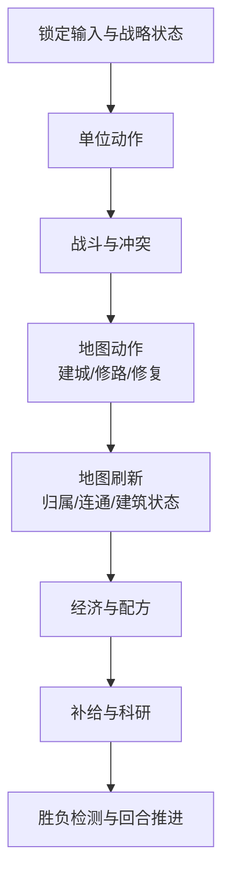
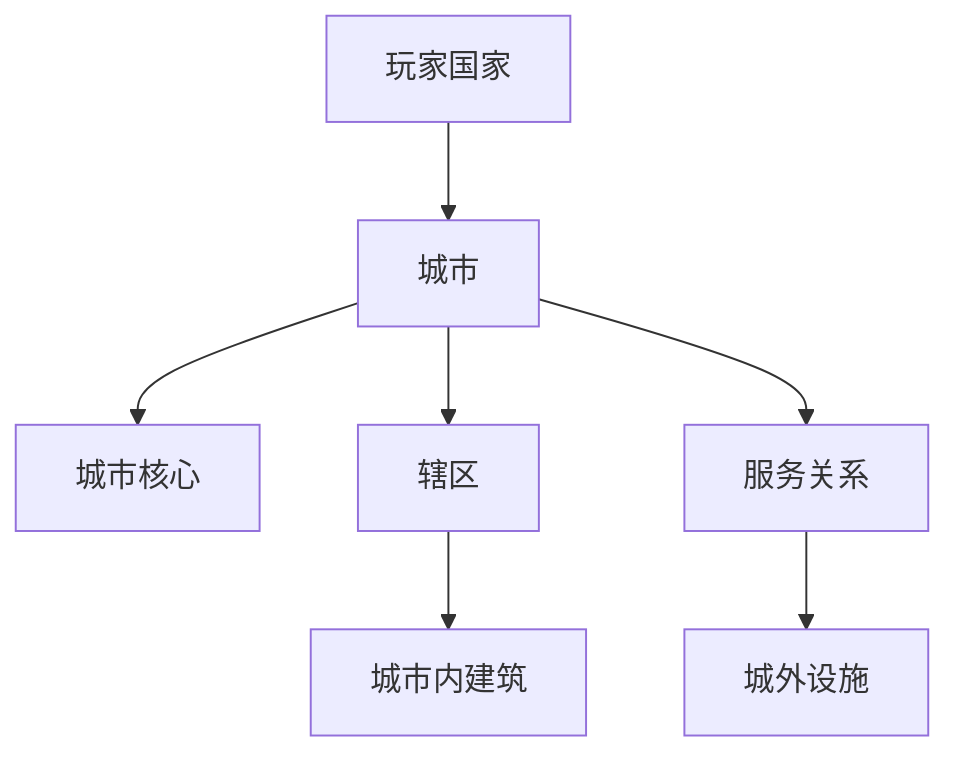

# Panoptes 游戏设计文档（结构版）

> 状态：设计基线文档  
> 日期：2026-04-15  
> 文档定位：兼顾策划表达、规则裁决与阶段演进的主 GDD  
> 相关文档：  
> - 总纲版：[2026-04-15-panoptes-gdd-v1.md](./2026-04-15-panoptes-gdd-v1.md)  
> - 细化叙述版：[2026-04-15-panoptes-gdd-v1-detailed.md](./2026-04-15-panoptes-gdd-v1-detailed.md)  
> - 回合结构基线：[../TURN_V2_REFACTOR_PLAN.md](../TURN_V2_REFACTOR_PLAN.md)  
> - 旧版整体 GDD：[./GDD_v0.1.md](./GDD_v0.1.md)  
> - 旧版政策稿：[./POLICY.md](./POLICY.md)

## 1. 文档说明

本文是 Panoptes 的主设计文档。它既不是实现说明，也不是创意备忘录，而是用于长期维护的策划基线。本文关注的核心问题包括：游戏要提供什么体验、每个系统在国家层面的职责是什么、系统之间通过何种规则关系耦合、各系统在不同发展阶段应当呈现怎样的形态。

为了避免“当前能做什么”和“长期想做什么”相互覆盖，本文统一采用三层阶段描述：

| 阶段 | 含义 |
|---|---|
| 当前基线 | 必须先成立的玩法骨架，是可游玩的 MVP 规则底座 |
| 中期扩展 | 在不推翻底座的前提下，补齐 Panoptes 的关键辨识度 |
| 长期目标 | 支撑 Panoptes 独特体验的完整系统形态 |

除特别说明外，本文中的回合时序统一引用 [TURN_V2_REFACTOR_PLAN.md](../TURN_V2_REFACTOR_PLAN.md) 中的 `planning / resolving` 口径。若与 [GDD_v0.1.md](./GDD_v0.1.md) 或旧双阶段描述存在冲突，以本文为准。

## 2. 核心定位

Panoptes 是一款回合制联机国家经营对抗游戏。玩家扮演的并非全知全能的上帝，而是拥有最终裁决权的国家领导者。游戏关注的不是局部最优操作，而是国家如何在统一回合中分配能力、组织空间、承受战争并逐步演化为一台具有自身惯性的国家机器。

这一定位决定了 Panoptes 与传统文明式 4X 的差异不在单一系统，而在系统关系。科技表达国家知道什么，政策表达国家正在实行什么，城市与建筑表达国家如何组织能力，战争则是国家结构承压后的结果。Panoptes 的独特性最终不依赖某个孤立玩法，而依赖这些系统共同组成的统治体验。

## 3. 设计支柱

Panoptes 的系统设计围绕四条支柱展开。

第一，统一规划，统一结算。玩家在同一个主要操作阶段内完成本回合全部意图，再由服务端按固定顺序统一结算。这样经济、建设、军事和政治共享同一时间语言，避免不同系统各自拥有不兼容的“立即生效”规则。

第二，国家能力分层。资源回答“国家拥有什么”，点数回答“国家本回合能调动多少能力”，修正回答“国家被塑造成了什么样子”。科技、政策、建筑和配方都以这三层为共同语义，而不是各自发明一套局部货币。

第三，城市是国家组织的基本单元。城市并非单纯的产出点，而是辖区、建筑、设施、仓储与制度承载的组织核心。城外设施允许存在，但必须能够被城市体系解释。

第四，控制权要能从“直接操作”平滑过渡到“代理执行”。系统表达必须同时容纳直接命令与代理命令，使玩家裁决权和国家执行层能够在同一规则结构中共存。

## 4. 阶段路线总览

| 层级 | 核心问题 | 系统特征 |
|---|---|---|
| 当前基线 | 这是否已经是一款完整可玩的游戏 | 统一回合、基础资源、自由建城、直接指挥 |
| 中期扩展 | 这是否已经体现出 Panoptes 的结构辨识度 | 核心兵种谱系、工程单位、制度槽位、网络激活 |
| 长期目标 | 这是否成为一款真正以国家机器和信息不对称为核心的游戏 | 大臣代理、双层迷雾、真实物流、PVE |

这一阶段划分不是把游戏拆成三款不同作品，而是规定系统生长顺序。当前基线解决闭环与可信度，中期扩展解决结构差异与空间组织，长期目标解决 Panoptes 的独特体验。

## 5. 回合结构

### 5.1 总述

Panoptes 的整体运行采用统一的 `planning -> resolving -> next_turn` 回合模型。所有系统都服从这一时间框架：玩家在 `planning` 中提交国家意图，服务端在 `resolving` 中按照固定步骤把这些意图转化为世界变化，再进入下一回合。玩家面对的是一次性决策与一次性后果，而不是边操作边修正的连续微操过程。

### 5.2 设计思路

回合结构是全文其余系统的时序根。若回合结构含糊，那么科技完成、建筑落地、配方推进、单位战斗和制度切换都无法共享一致的生效语言。Panoptes 选择统一主阶段，不是为了压缩 UI，而是为了要求玩家以“本回合国家整体怎么运转”为单位思考问题，而不是分别处理内政题和战斗题。

### 5.3 核心定义

| 概念 | 定义 |
|---|---|
| `planning` | 玩家提交本回合全部国家意图的阶段 |
| `resolving` | 服务端按照固定顺序统一结算世界变化的阶段 |
| 输入锁定 | 进入结算前，回合命令、研究目标、国策、配方等被视为本回合有效输入 |
| 生效时点 | 某项结果何时显示、何时开始提供持续收益或规则效果 |

### 5.4 玩家可见流程


玩家可见的流程应当保持稳定和清晰，不因具体系统扩展而出现新的“主阶段”。即便命令来源和汇报层级变得更复杂，玩家面对的仍应是同一条统一回合主线。

### 5.5 服务端结算流程



这一顺序的含义在于：单位与战斗先决定谁还活着、谁控制哪些关键位置；地图动作随后决定城市、道路和设施的成立情况；经济、配方和科研则永远读取“本回合末最终地图”。这样能够有效避免回合内循环引用与连锁爆炸。

### 5.6 生效口径

Panoptes 统一采用“地图先反馈，持续收益后生效”的规则。玩家可以在本回合立即看到世界变化，但长期产出、长期修正和长期资格通常在下一回合正式成立。

| 内容 | 结果展示 | 正式收益或规则生效 |
|---|---|---|
| 单位移动、战斗结果 | 本回合结算 | 立即进入地图与单位状态 |
| 建城、修路、建筑落地 | 本回合结算 | 地图立刻可见，常规收益下一回合开始 |
| 道路连通变化 | 本回合结算 | 本回合末可参与连通与补给判定 |
| 科技完成 | 本回合结算 | 下一回合正式生效 |
| 制度切换 | `planning` 确认 | 下一回合正式生效 |
| 国策切换 | `planning` 确认 | 本回合结算开始生效 |

### 5.7 阶段演进

| 阶段 | 回合结构目标 |
|---|---|
| 当前基线 | 建立统一 `planning / resolving` 结构，取消并列主阶段 |
| 中期扩展 | 在同一结构下接入更多命令类型、制度调整与工程行为 |
| 长期目标 | 在不打破统一回合的前提下接入大臣审阅、有限覆写与失真汇报 |

## 6. 经济基础：资源、点数与修正

### 6.1 总述

Panoptes 的经济基础不是单一货币，而是由资源、点数和修正三层共同构成的国家能力结构。资源表示国家拥有的物质存量，点数表示国家在单回合内可调动的行动能力，修正则表示国家在结构上被塑造成何种样态。三者共同作用，构成科技、政策、建筑、配方、城市和军事系统的通用语言。

### 6.2 设计思路

若只保留资源，那么科研、建造、制度与行政都会退化成“另一种材料”；若只保留点数，那么国家经营会失去真实的物质基础；若不建立统一修正系统，那么科技、政策和建筑效果就会分裂成互不兼容的数值堆叠。Panoptes 将这三层同时设立，是为了让国家成长既有物质性，又有节奏性，还能体现国家结构差异。

### 6.3 核心定义

| 概念 | 定义 |
|---|---|
| 资源 | 可库存、可结转、可作为生产输入与输出的物质性对象 |
| 点数 | 绑定于国家层的非库存能力值，用于推进研究、建设和其他国家行为 |
| 显式效果 | 直接改变国家“能做什么”的高语义效果 |
| 修正效果 | 改变国家“做得多快、多好”的可叠加效果 |

### 6.4 资源体系

资源是国家拥有的物质性内容。它们可以被采集、加工、消耗、运输和库存，是国家经济链条中最具实体感的部分。资源并不直接表达一项国家行为的速度，而是表达国家是否具有足够的物质基础来支撑这一行为。

资源应满足以下定义特征：

| 特征 | 说明 |
|---|---|
| 可库存 | 会留存在国家库存或城市仓储中 |
| 可结转 | 可从一个回合保留到后续回合 |
| 可转化 | 可作为配方的输入与输出 |
| 可定位 | 在完整物流体系中，资源应当具有来源地与去向地 |

在策划层面，资源库存可用下式表达：

```text
资源存量(t+1) = 资源存量(t) + 本回合产出 + 本回合输入 - 本回合消耗 - 本回合损失
```

资源样例与阶段位置如下：

| 资源 | 资源性质 | 阶段位置 |
|---|---|---|
| 粮食 | 一级原始资源 | MVP |
| 木材 | 一级原始资源 | MVP |
| 矿石 | 一级原始资源 | MVP |
| 精炼金属 | 二级加工资源 | 中期 |
| 工程材 | 二级加工资源 | 中期 |
| 军备品 | 高级军需资源 | 后期 |

### 6.5 点数体系

点数是国家层的行动能力，而不是另一种可囤积材料。它所表达的不是“国家持有多少”，而是“国家在本回合能推进多少事情”。因此，点数的关键特征是按回合结算、与国家结构强相关、主要以推进值形式消耗。

点数的统一表达如下：

| 点数 | 含义 | 典型作用 |
|---|---|---|
| 科研产出 | 国家知识增长能力 | 推进当前科技进度 |
| 建造/工业产出 | 国家建设与生产推进能力 | 推进建筑、工程与部分配方 |
| 行政/治理产出 | 国家维持制度与官僚系统的能力 | 支撑制度与大臣体系 |

点数的有效值可采用统一口径：

```text
有效点数 = 基础点数 × (1 + 百分比修正和) + 固定修正和
```

点数不应成为长期蓄水池。它们更接近国家机器本回合的输出能力，因此默认在结算中被消化为研究、建设或其他推进结果。

### 6.6 修正体系

Panoptes 中的国家效果分为显式效果与修正效果两个层面。两者必须分开定义，因为它们解决的是不同问题：前者改变国家可以做什么，后者改变国家做事的效率与品质。

显式效果主要承载高语义变化。例如解锁一类建筑、解锁一条配方、解锁一个制度候选、开放某个兵种谱系、授予特定单位、增加制度槽位等。这类效果不宜被压缩成单纯数值修正，因为它们会直接改变系统边界。

修正效果则承载可叠加的效率变化。例如科研效率修正、建造推进率修正、特定配方效率修正、单位属性修正、守城修正、维护成本修正等。修正效果的目标不是告诉玩家“国家获得了新选项”，而是告诉玩家“国家以何种风格运行这些选项”。

默认计算口径如下：

```text
最终值 = (基础值 × (1 + 百分比修正和)) + 固定修正和
```

若个别系统需要特殊顺序，例如先固定后百分比，必须在对应章节另行声明。

### 6.7 系统关系

资源、点数与修正不是三套平行系统，而是其他系统的共同底座。科技通过显式效果与修正效果塑造国家能力，政策通过修正与制度边界塑造国家方向，建筑通过资源转化和点数支持承载国家物理能力，配方则把资源、点数和建筑能力转化为具体产出。换言之，经济基础不是“经济章节专用规则”，而是 Panoptes 全局规则语言的第一层。

### 6.8 阶段演进

| 阶段 | 经济基础目标 |
|---|---|
| 当前基线 | 建立资源、点数、修正三层结构；资源使用全局虚空库存；点数聚焦科研产出与建造/工业产出 |
| 中期扩展 | 引入二级加工资源；扩展行政/治理类点数；让更多系统显式读取修正系统 |
| 长期目标 | 与城市仓储、真实物流、迷雾和大臣系统完全耦合，形成完整国家经济网络 |

## 7. 城市系统

### 7.1 总述

城市是 Panoptes 中最基本的国家组织单元。它不是单纯的地图落点，而是一个由城市核心、辖区、建筑承载、设施归属与行政能力共同构成的结构。城市回答的问题不是“这里有没有一个据点”，而是“国家在这里如何组织空间、生产与统治”。

### 7.2 设计思路

Panoptes 需要同时保留文明式自由建城与国家机器式组织约束。若所有建筑都必须预设在城市节点上，扩张会失去探索与落点判断；若所有建筑都能脱离城市自由漂浮，后续的制度、仓储、物流、占领与大臣治理又会失去组织核心。为兼顾这两点，城市必须被设计为一种关系结构，而不是一个孤立地块。

### 7.3 核心定义

| 概念 | 定义 |
|---|---|
| 城市 | 以城市核心为中心组织辖区、建筑与设施的国家单元 |
| 主城 | 开局已存在、具有更高战略权重的特殊城市 |
| 城市核心 | 定义城市存在、归属与胜负价值的特殊建筑 |
| 辖区 | 该城市可直接承载内部建筑与行政能力的空间范围 |
| 服务城市 | 某城外设施默认绑定并向其输送产出的城市 |

### 7.4 城市结构



城市内建筑必须落在辖区内；城外设施可以位于辖区外，但必须在规则上属于某一座城市的服务范围。这样，城市就成为国家组织生产与空间控制的实际节点。

### 7.5 规则口径

建城合法性可采用下式表达：

```text
建城合法
= 可建城地块
∧ 非既有建筑占位
∧ 非敌方核心控制区
∧ 满足最小城距
```

城市一旦成立，便获得城市核心、基础辖区与承载资格。城市的存在并不要求立即具备复杂的成长系统，但必须从规则上承认辖区、内部建筑资格与外部设施绑定关系，以便后续自然扩展为更复杂的城市治理。

### 7.6 阶段演进

| 阶段 | 城市系统目标 |
|---|---|
| 当前基线 | 主城开局存在，开拓者可自由建城；采用固定初始辖区；建立城市核心与服务城市关系 |
| 中期扩展 | 引入城市等级、辖区扩展机制与城市功能分化 |
| 长期目标 | 接入仓储、区域治理、制度槽位承载与大臣辖区管理，形成完整城市行政结构 |

## 8. 建筑系统

### 8.1 总述

建筑是国家能力的空间载体。它们既承接城市组织，也承接资源采集、配方生产、局部防御与制度能力。建筑不是单纯的“每回合产出表”，而是国家在地图上的物理化器官。

### 8.2 设计思路

若不同建筑类型各自拥有独立底层逻辑，系统扩展会迅速碎裂。Panoptes 采用统一建筑底座与功能标签的思路，使城市核心、资源设施、加工建筑、军事生产建筑、防御建筑、仓储建筑与治理建筑都能够在同一语言中被描述。建筑系统应先回答“这是什么对象、它在国家机器中扮演什么角色”，再回答“它具体加多少数值”。

### 8.3 核心定义

所有建筑共享以下基本属性：

| 属性 | 含义 |
|---|---|
| 所有权 | 建筑归属哪个玩家 |
| 城市隶属或设施归属 | 建筑属于哪座城市，或作为哪类城外设施存在 |
| 合法位置 | 建筑可放置的空间规则 |
| 生命/耐久 | 建筑承受战争与破坏的能力 |
| 激活状态 | 建筑当前是否具备正常运作资格 |
| 配方承载 | 建筑是否可运行以及如何运行配方 |
| 效果集合 | 建筑提供的显式效果与修正效果 |

### 8.4 建筑分类与标签

建筑的分类应以其在国家机器中的功能为基础，而不是仅按美术或产出归类。推荐标签包括：

| 标签 | 设计含义 |
|---|---|
| `core` | 城市存在与胜负价值的核心建筑 |
| `extraction` | 将地块资源转化为国家输入的设施 |
| `processing` | 将原始资源转化为中间资源的建筑 |
| `production` | 将资源与点数转化为单位或其他产出的建筑 |
| `storage` | 与库存、仓储和物流相关的建筑 |
| `defense` | 改变地块与城市防御能力的建筑 |
| `governance` | 与制度、行政和科研结构相关的建筑 |

### 8.5 建筑与城市的关系

建筑在空间关系上分为城市内建筑与城外设施两类。城市内建筑必须位于某座城市的辖区内，它们代表的是城市内部组织能力，例如加工、军工、仓储、治理与大多数防御。城外设施则位于城市外部，但通过服务关系与某座城市绑定，它们代表的是国家向外延伸的生产触手，例如资源采集设施。

这一设计使建筑系统能够与城市系统、占领系统和物流系统保持一致。建筑永远既属于某个玩家，也处于某个城市组织关系之中。

### 8.6 阶段演进

| 阶段 | 建筑系统目标 |
|---|---|
| 当前基线 | 建立统一建筑底座、城市内建筑与城外设施双轨模型、基础标签体系 |
| 中期扩展 | 扩展更多专业标签，使建筑与制度、科研、城市分工产生更强关系 |
| 长期目标 | 让建筑完整接入物流、迷雾、大臣治理与多层国家结构 |

## 9. 建筑状态、占领与摧毁

### 9.1 总述

建筑的战争命运不应被简化为“要么归我，要么消失”。Panoptes 中的建筑既是物理对象，也是国家组织的一部分，因此在战争中可能出现停用、争夺、接管、废墟等不同状态。这样的处理方式更能体现战争对国家机器的破坏与重组，而不是单纯的数值翻转。

### 9.2 设计思路

若建筑一旦失守就立刻原样归敌，那么高级国家机器会变成毫无代价的战利品；若建筑一旦失守就全部清空，那么城市与生产结构又会缺乏延续性。Panoptes 采用介于两者之间的处理方式：战争首先打断建筑的运转，再根据建筑类型、空间位置与持续控制结果，决定其接管或废墟化命运。

### 9.3 核心定义

| 状态 | 含义 |
|---|---|
| 激活 | 建筑正常参与国家运作 |
| 停用 | 建筑仍然存在，但因控制、连通、服务或输入问题无法运作 |
| 争夺 | 建筑处于控制转移过程中，原功能已被打断 |
| 接管 | 建筑的所有权与服务关系转移至新控制者 |
| 废墟 | 建筑物理存在被打断，需要重建或修复才能再次使用 |

### 9.4 规则口径

城外设施采用“先失效，后接管”的规则。敌方首次有效控制设施所在位置时，设施先进入停用或争夺状态，原拥有者立即失去相关产出；只有在连续控制达到阈值后，设施才会正式完成接管：

```text
正式接管条件 = 连续有效控制回合 >= N
```

其中 `N` 为可调参数。

城市陷落后的建筑处理采用“部分接管，部分废墟”的原则。基础民生、基础仓储、基础加工类建筑更适合进入接管池，因为它们代表的是地方生产能力；高级防御、制度、军工和高等级治理建筑更适合进入废墟或失效池，因为它们代表的是旧国家机器的结构，不应被敌方完整继承。

### 9.5 阶段演进

| 阶段 | 建筑状态系统目标 |
|---|---|
| 当前基线 | 建立激活、停用、接管、废墟等基本状态；实现城外设施延时接管；确立城市陷落的部分接管/部分废墟原则 |
| 中期扩展 | 按建筑标签细化不同建筑的战时命运与修复逻辑 |
| 长期目标 | 让接管速度、破坏倾向和战后恢复能力与制度、工程单位、大臣决策耦合 |

## 10. 配方系统

### 10.1 总述

配方系统是 Panoptes 的生产语言。凡是需要把输入转化为输出的国家行为，都应优先被定义为配方运行，而不是拆成彼此无关的局部特判。配方系统连接资源、点数、建筑、城市和单位生产，是国家经济与建设行为的共通表达方式。

### 10.2 设计思路

配方的重点不在于“数量很多”，而在于“规则统一”。当玩家看到一座建筑时，能够回答“它正在运行什么”“它为什么会慢”“它会产出什么”，这比大量零碎产出项更重要。Panoptes 因此选择以工作量推进为核心，使国家成长可以通过提升推进率和运行效率来直接体现。

### 10.3 核心定义

一个完整配方至少应包含以下要素：

| 要素 | 含义 |
|---|---|
| 承载者 | 哪类建筑或对象可以运行该配方 |
| 输入 | 需要消耗的资源与点数 |
| 工作量 | 配方从开始到完成所需的总推进量 |
| 推进率 | 单回合在理想条件下能够完成的工作量 |
| 输出 | 配方完成后产生的资源、单位、点数增量或局部状态 |
| 运行效率 | 输入不足时实际能以多大效率推进 |

### 10.4 规则口径

Panoptes 中的配方运行应当以统一推进模型表达：

```text
本回合新增进度 = 基础推进率 × (1 + 修正总和) × 运行效率
```

其中，基础推进率来自建筑、城市或国家能力；修正总和来自科技、制度、建筑与其他系统；运行效率则取决于资源、点数和其他前置条件的满足程度。

在策划表述上，运行效率可理解为一个处于 `0` 到 `1` 之间的系数。输入完全满足时，配方按正常效率推进；输入部分短缺时，配方进入低效推进；关键条件完全丧失时，配方可以停滞。这样既能表现“资源不足导致拖延”的国家运转感，也能避免所有短缺都直接退化成硬性报错。

### 10.5 配方产出与边界

配方的产出范围应主要落在以下几类：实体资源、单位、点数增量或推进、局部状态。这样的边界足以覆盖采集、加工、训练、工程与部分功能性运作，同时避免配方系统越权吞掉科技或制度系统的职责。制度层变化、国家治理边界与科技解锁仍应通过科技和政策系统表达。

### 10.6 阶段演进

| 阶段 | 配方系统目标 |
|---|---|
| 当前基线 | 建立单建筑单激活配方、工作量推进、输入不足导致低效或停滞的统一规则 |
| 中期扩展 | 引入配方队列、二级资源加工链与更复杂的局部状态 |
| 长期目标 | 让配方系统成为完整工业链、物流调度与大臣执行的生产语言 |

## 11. 科技系统

### 11.1 总述

科技系统表达的是国家知道什么。它不是另一种数值池，而是国家知识结构的展开方式。科技不仅决定国家有哪些数值修正，更决定国家是否理解某类建筑、配方、兵种、制度与治理方法。

### 11.2 设计思路

Panoptes 的科技不应主要写成加成列表，而应被设计为国家能力边界的拓展器。玩家研究科技，不是单纯为了给旧行为叠一层百分比，而是为了把新的组织方式和新层级的国家能力纳入可用空间。只有这样，科技系统才能与政策、建筑和配方产生真正的结构关系。

### 11.3 核心定义

| 要素 | 含义 |
|---|---|
| 科技节点 | 科技树中的单个研究对象 |
| 前置依赖 | 某科技解锁前必须完成的科技集合 |
| 研究成本 | 完成该科技所需的累计科研进度 |
| 解锁效果 | 开放新建筑、配方、制度候选、兵种等的显式效果 |
| 修正效果 | 对科研、建造、单位或建筑效率产生影响的修正效果 |

### 11.4 研究规则

科研推进采取“目标科技累积进度”的方式。玩家在 `planning` 中指定当前研究目标，国家在回合结算时把科研产出灌入该科技的进度中。研究进度附着在科技节点本身，而不是以自由科技点的形式存放在玩家手中。

科技完成时，系统应在本回合给予明确反馈，但其显式效果与修正效果从下一回合开始正式进入规则层。这样既能够提供及时成就感，又避免科技完成反向修改本回合已提交动作的合法性。

### 11.5 阶段演进

| 阶段 | 科技系统目标 |
|---|---|
| 当前基线 | 建立前置依赖、目标研究、科研自动推进、切线保留进度、完成次回合生效 |
| 中期扩展 | 强化科技分支定位，让科技与制度、城市分工和专业兵种谱系形成稳定关系 |
| 长期目标 | 让科技成为国家知识边界的总开关，并与大臣判断、物流能力和区域治理深度耦合 |

## 12. 政策系统

### 12.1 总述

政策系统表达的是国家正在实行什么。它与科技系统独立，但会受科技提供的知识边界所约束。政策不是科技的翻版，而是国家把既有知识转化为现实治理形态的方式。

### 12.2 设计思路

为避免科技与政策相互覆盖，Panoptes 采用双层政策结构。国策层表达国家在短周期内的整体方向，制度层表达国家在中长期内持续生效的结构安排。前者偏向姿态与优先级，后者偏向秩序与组织方式。

### 12.3 核心定义

| 层级 | 定义 |
|---|---|
| 国策 | 君主对国家本回合总方向的宣告，直接影响当回合权重与修正 |
| 制度 | 国家长期生效的治理配置，由科技解锁候选并装填至有限槽位 |
| 制度槽位 | 国家可同时维持的制度数量上限 |
| 候选池 | 通过科技等方式获得、可供启用的制度集合 |

### 12.4 规则口径

国策在 `planning` 中选择，并从本回合结算开始生效。它主要改变国家优先级与阶段性修正，例如更偏向扩张、备战、恢复或整饬。制度则以槽位装填方式维持生效，其切换应体现出结构性调整的性质，因此默认在下一回合正式生效。部分制度候选可以由科技提供，但政策系统本身并不从属于科技系统。

这样的关系可以概括为：科技决定国家能理解哪些制度与方法，政策决定国家此刻真正选择实行哪些制度与方向。

### 12.5 制度类别与影响范围

制度应按类别组织，而不是做成“同一池子里随便装几个”的泛化槽位。类别表达的是国家治理维度上的排他选择，同类别通常同时只能启用一个制度。

推荐的基础类别如下：

| 类别 | 含义 |
|---|---|
| `power` | 权力制度，决定中央、地方与大臣之间的权力分配 |
| `citizenship` | 公民制度，决定国家默认优先保护与动员的人群 |
| `economy` | 经济制度，决定生产组织和短缺分配的长期规则 |
| `trade` | 贸易制度，决定市场、贸易与外部资源的组织方式 |
| `military` | 军事制度，决定军队维护、动员与补给的长期结构 |
| `administration` | 行政制度，决定信息汇总、报告精度与执行链条 |

制度影响国家的方式应集中在长期结构，而不是一次性命令。它们可以：

- 提供国家修正，例如科研产出、配方推进、单位维护或物流容量修正
- 改变物流优先级，例如优先保障工业、军队、研究或贸易链条
- 提供治理效果，例如报告精度、大臣自主度或行政效率变化
- 通过科技或其他显式效果进入候选池，并在必要时扩展制度槽位

### 12.6 阶段演进

| 阶段 | 政策系统目标 |
|---|---|
| 当前基线 | 确立国策与制度双层结构；优先保证国策层完整成立；制度层至少在设计上成立并保留代表性内容 |
| 中期扩展 | 实装制度槽位、扩展候选池，并稳定科技解锁与制度装填之间的关系 |
| 长期目标 | 引入更复杂的政治代价、稳定性压力与大臣偏好，使制度成为国家机器核心骨架之一 |

## 13. 单位系统

### 13.1 总述

单位系统是国家命令在地图上的执行层。它承担扩张、移动、占位、交战和工程执行等职责，并连接玩家命令、大臣代理、城市扩张与军事系统。单位的存在意义不只是让地图上有棋子，而是让“谁在替国家行动”这一问题获得明确表达。

### 13.2 设计思路

Panoptes 的单位系统应当兼容直接操作与代理执行两种控制形态。这样一来，玩家既可以直接下达关键命令，也可以在更复杂的国家结构中审阅和覆写执行层建议。单位系统从设计上应服务于这种权力转移，而不是固化为纯手操战棋。

### 13.3 核心定义

| 概念 | 定义 |
|---|---|
| 平民单位 | 负责扩张、工程与非直接战斗职能的单位 |
| 军事单位 | 负责战斗、占位、攻城与破坏等职能的单位 |
| 直接命令 | 由玩家在 `planning` 中直接提交的单位指令 |
| 默认命令 | 由大臣或系统生成、等待玩家确认或覆写的单位指令 |

### 13.4 单位结构

单位应按国家职能而非仅按战斗属性进行理解。平民单位承担开拓、工程与地方执行功能；军事单位承担战斗、推进、攻城与袭扰功能。两者都应服从统一的命令表达与统一的回合结算逻辑。

在设计上，平民单位与城市、建筑、道路系统的关系应比与纯数值成长关系更重要，因为它们本质上是国家意志如何在地图上落地的执行者。

### 13.5 阶段演进

| 阶段 | 单位系统目标 |
|---|---|
| 当前基线 | 玩家直接指挥；仅保留开拓者与步兵两类单位；以清晰的扩张与基础战斗为重点 |
| 中期扩展 | 引入工程单位；扩展为开拓者、步兵/战士、弓手、攻城单位、破坏/袭扰单位五个核心谱系 |
| 长期目标 | 接入大臣默认命令与有限覆写；补充更高机动与更高专精单位，使单位成为国家机器的执行层 |

## 14. 军事系统

### 14.1 总述

军事系统是国家结构在高压条件下的检验机制。它不仅处理单位之间的冲突，也检验城市布局、道路组织、制度选择和生产能力是否能够支撑持续战争。军事系统的价值不在于把战斗做得繁复，而在于让国家经营的结果在战场上变得可见。

### 14.2 设计思路

战争首先必须可信，随后才谈复杂。若基础移动、接敌、冲突、占位和主城摧毁都不清晰，那么再多战术细节也无法成立。Panoptes 因此先强调统一结算下的战斗因果关系，再逐步把兵种谱系、道路节点、工程行为和国家制度纳入战争。

### 14.3 核心定义

| 概念 | 定义 |
|---|---|
| 接敌 | 敌对单位或建筑进入直接冲突条件的状态 |
| 占位 | 单位通过位置控制影响地块、设施或城市周边的能力 |
| 攻城 | 围绕城市核心、城防和关键建筑展开的军事行为 |
| 破坏 | 以打断设施、道路、建筑状态和国家网络为目标的军事行为 |

### 14.4 战争结构

Panoptes 的战争并非独立于经济与政治的小游戏。单位冲突会影响城市安全与设施状态，城市结构和道路连通又会反过来影响战争的持续能力。随着更多兵种、工程行为与制度差异加入，战争会自然从“数值对撞”转变为“国家组织能力对撞”。

### 14.5 阶段演进

| 阶段 | 军事系统目标 |
|---|---|
| 当前基线 | 建立基础单位命令、战斗与主城核心摧毁判负；军事建筑以被动防御为主 |
| 中期扩展 | 引入专业兵种谱系、道路与设施争夺、工程单位的前线作用、更加清晰的攻城与破坏逻辑 |
| 长期目标 | 让战争围绕城市、制度、物流、大臣与信息不对称共同展开，形成真正的国家战争 |

## 15. 道路、连通与物流

### 15.1 总述

道路系统是国家空间组织的骨架，连通是国家网络是否成立的判定语言，物流则是国家能力在空间中如何实际流动的过程。三者构成从“地图骨架”到“国家网络”的连续演进链。

### 15.2 设计思路

道路系统不宜直接被写成完整物流模拟，否则国家经营会过早承担大量调度复杂度。更合理的做法是分层推进：先确立道路作为空间骨架的地位，再让连通承担经济激活逻辑，最后才让物流进入资源存储和运输层。

### 15.3 核心定义

| 概念 | 定义 |
|---|---|
| 道路 | 地图基础设施与运输通路 |
| 连通 | 对象与国家网络之间存在有效连接 |
| 激活 | 对象因连通而具备参与国家运作的资格 |
| 运量 | 单位时间内道路可承载的资源流动量 |

### 15.4 规则口径

在逻辑上，道路、连通和物流应构成一条清晰链条：道路提供连接可能，连通判定某对象是否属于国家有效网络，物流则在此基础上决定资源如何在网络中实际流动。连通首先解决“是否属于有效网络”，物流再进一步解决“能否到达、到达多少、优先送往哪里”的运输问题。

### 15.5 阶段演进

| 阶段 | 道路与物流目标 |
|---|---|
| 当前基线 | 道路主要承担地图骨架与移动组织，不承担经济物流 |
| 中期扩展 | 建立“连通才激活”的规则，使资源点、设施与新城受网络状态影响 |
| 长期目标 | 引入本地仓储、道路运输、运量限制与资源调度策略，形成完整国家物流系统 |

## 16. 信息系统与大臣系统

### 16.1 总述

信息系统与大臣系统是 Panoptes 辨识度的来源。它们解决的问题不是“给玩家更多提示”，而是“玩家通过什么渠道认知世界、通过什么层级影响国家机器”。这决定了 Panoptes 的特色体验不是对世界的直接操作，而是对汇报、代理与有限干预的管理。

### 16.2 设计思路

若在基础玩法尚未稳定时就强行引入失真信息和代理执行，玩家会把大量失败归因于系统不透明，而非自己的国家判断。因此，信息与大臣系统必须建立在清晰的底座之上：先保证玩家理解统一回合下的因果关系，再逐步把真实世界与被汇报世界分离。

### 16.3 核心定义

| 概念 | 定义 |
|---|---|
| 可见性层 | 决定玩家或国家机器理论上能观察到什么 |
| 信息来源层 | 决定情报由谁、以什么方式生成 |
| 汇报层 | 决定玩家最终接收到什么信息及其形式 |
| 执行层 | 决定国家命令由谁生成、谁执行、谁承担偏差 |

### 16.4 信息结构


这张结构图表达的是 Panoptes 信息结构的本质：玩家不再只面对世界本身，而是面对国家机器关于世界的解释，并通过国家机器把自己的意志再度投回世界。

### 16.5 阶段演进

| 阶段 | 信息与大臣系统目标 |
|---|---|
| 当前基线 | 不启用战争迷雾、内政迷雾与失真汇报；玩家直接读取服务端权威信息；仅预留大臣接入接口 |
| 中期扩展 | 大臣开始生成默认命令与结构化汇报，玩家进行有限覆写；汇报层开始承载更多叙事与治理含义 |
| 长期目标 | 接入双层迷雾、失真汇报、忠诚与性格机制、亲政干预，使大臣系统成为 Panoptes 的核心体验 |

## 17. PVE

### 17.1 总述

PVE 在 Panoptes 中不是与 PVP 并列的一套特殊玩法，而应当是玩家系统的复用者。PVE 势力若不使用同一套科技、政策、城市、建筑、配方与单位逻辑，就无法验证国家系统本身是否具有自洽性。

### 17.2 设计思路

Panoptes 的理想 PVE 不是脚本怪潮，也不是单纯加数值的电脑对手，而是能够在同一国家规则下运行的服务器控制势力。这样，玩家在 PVP 中学到的国家判断、前线组织和后勤压力，才能在 PVE 中继续成立。

### 17.3 阶段演进

| 阶段 | PVE 目标 |
|---|---|
| 当前基线 | 不开发 PVE，对外不承诺单独玩法 |
| 中期扩展 | 预留规则复用接口，确保 AI 势力未来可以直接使用玩家底座 |
| 长期目标 | 实现基于同一国家规则运行的服务器控制势力 |

## 18. 总结

若把本文压缩成一句话，那么 Panoptes 要建立的不是若干零散功能，而是一套能自我生长的国家语言：统一回合提供共同时间框架，资源、点数与修正提供共同能力语言，城市与建筑提供共同空间组织，配方、科技与政策提供共同成长逻辑，单位、道路与战争提供共同执行与压力测试，而信息与大臣系统则为这一切预留最终的统治视角。

只要这套语言能够在同一规则框架内自然扩展，Panoptes 就能在不推翻底座的前提下，从一款完整的国家经营对抗游戏，成长为一款真正围绕国家机器、代理执行与信息不对称展开的作品。
